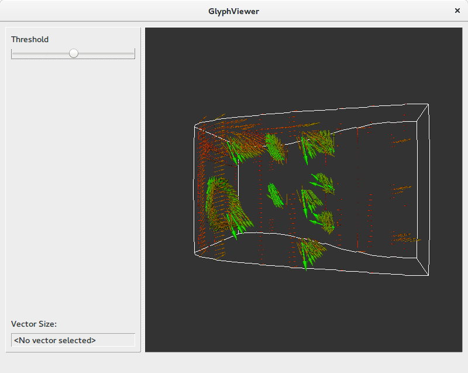

# tutorial-vtk-pyqt
Learn how to integrate vtk with pyqt in python

This tutorial will show

- Integrate the VTK widget into a QT application
- Pass signals from QT to VTK
- Pass signals from VTK to QT

## 0: Startup

This tutorial starts with a visualization of volumetric data based on glyphs. 
The explanation for this part can be found [here](https://github.com/diego0020/tutorial-vtk-python/blob/master/volumes_example.ipynb)

## 1: Make it a class

The first task is encapsulating the logic into a class. This will make it easier to include into a larger program.

## 2: Embed in Qt

Now the class will be transformed into a Qt-Widget and embedded inside a very simple PyQt interface. We have not connected any of the controls yet. The important changes are

- Changing the windowInteractor to a `QVTKRenderWindowInteractor`
- Getting the render window from the interactor
- Moving the `interactor.Initialize()` call to the start method. This method *must* be called after the widget is visible.
- Encapsulate the `QVTKRenderWindowInteractor` into a `QFrame`, which can be manipulated with more freedom.

Notice that now the main loop is handled by PyQt instead of VTK.

## 3: Connect Qt to VTK

This is very easy. It is only necessary to connect a Qt event to a method in the vtk class.

## 4: Connect VTK to QT

This is more tricky. The objective is to notify Qt after the user *picks* and object in the vtk widget. The default behaviour of vtk is to fire a *pick* event when the user presses the `p` key on the keypboard. This is not very intuitive, so first we need to translate standard clicks into picks. The complete chain is

1. Create *pick* events from *click* events. See the method `click_to_pick`.
2. Capture *pick* events and emit a *QtSignal*. See the method `process_pick`
3. Connect the new *QtSignal* to a method in the main application class.
